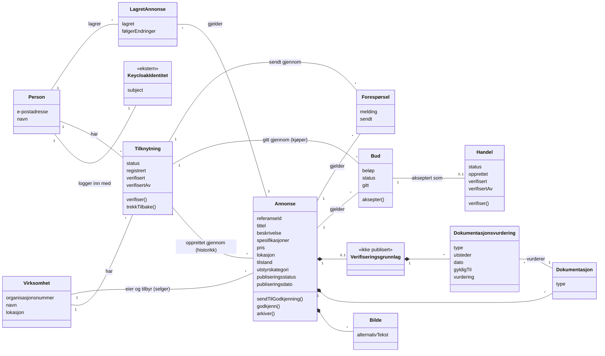
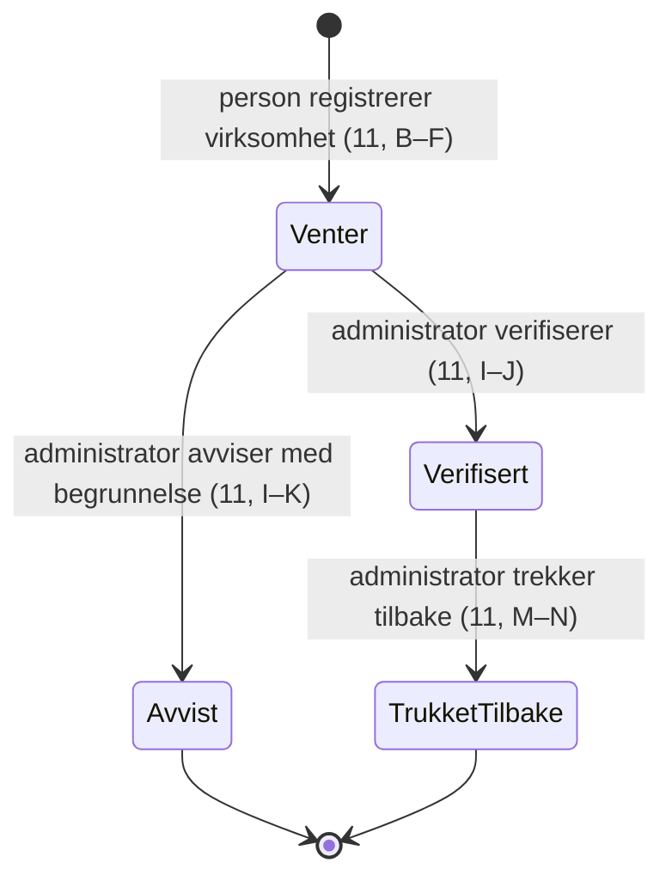
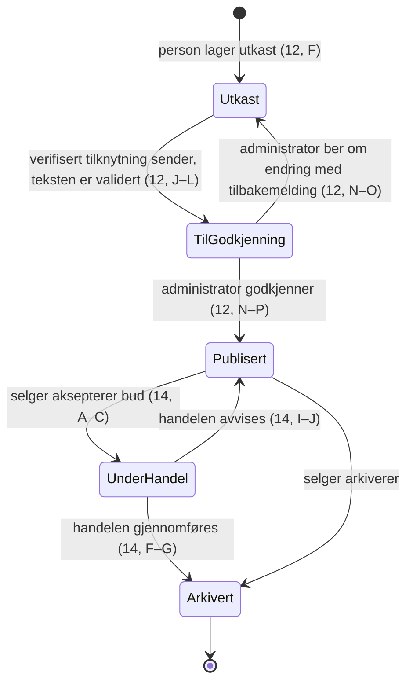
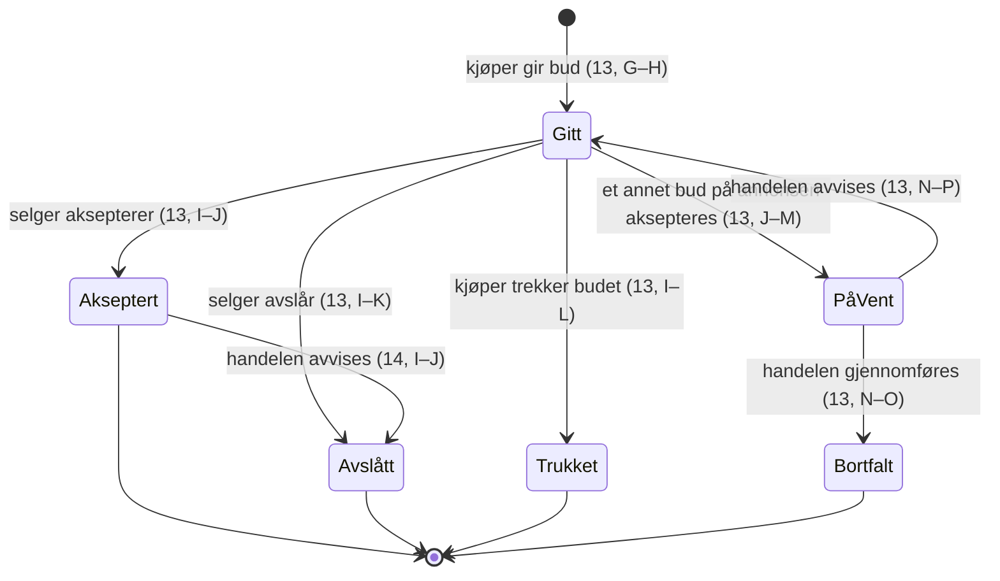
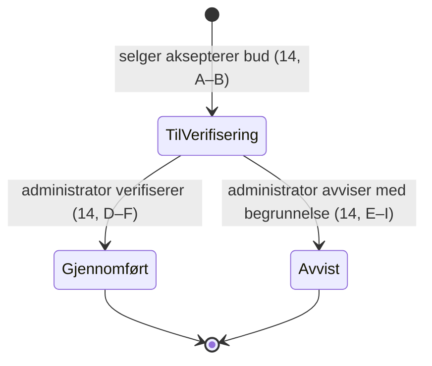

# Domenemodell

Status: **Utkast til grilling** (D1, #12). Laget med skillen
`domain-model-diagram`. Begrepene er definert i `CONTEXT.md`; denne filen
viser hvordan de henger sammen. Ingen implementasjonsdetaljer.

Modellen er en raffinering av userflowene (se `docs/design/README.md`).
Primærkilder: userflow 10–15 i `docs/userflows/`. Øvrige kilder:
`CONTEXT.md`, beslutningsnotat 0007 (verifisert tilknytning og handel),
0008 (WCAG), 0009 (innebygd personvern) og designhåndboken i
`DesignMarketPlace/`.

## 1. Lingvistisk analyse

### Substantiver

| Substantiv | Klasse | Kilde |
| --- | --- | --- |
| Person | entitet | 0007: «en person handler for en virksomhet» |
| Virksomhet | entitet | 0007: «Virksomheten er part i annonser, bud og handler» |
| Organisasjonsnummer | verdiobjekt | CONTEXT: virksomhet «identifisert med organisasjonsnummer» |
| Tilknytning | entitet | 0007: «gjennom en tilknytning som markedsplassadministratoren verifiserer» |
| Markedsplassadministrator | rolle (for en person) | CONTEXT: «En autorisert person som verifiserer …» |
| Selger | rolle (for en virksomhet i en annonse) | 0007: «Selger og kjøper er roller i en bestemt annonse eller handel» |
| Kjøper | rolle (for en virksomhet i et bud) | 0007, som over |
| Annonse | entitet | CONTEXT |
| Utkast | tilstand av annonse | CONTEXT: «En annonse under utarbeidelse» |
| Publiseringsstatus | verdiobjekt (livssyklus) | CONTEXT: «utkast, til godkjenning, publisert eller arkivert» |
| Utstyr | del av annonse, ikke egen entitet (S1) | CONTEXT: «Det fysiske akvakulturutstyret som tilbys i en annonse» |
| Utstyrskategori | verdiobjekt | CONTEXT |
| Lokasjon | verdiobjekt | CONTEXT |
| Tilstand | verdiobjekt | CONTEXT |
| Pris | verdiobjekt | designhåndboken: «tittel, pris og lokasjon» |
| Tittel, beskrivelse, spesifikasjoner | attributter på annonse | designhåndboken: annonsedetalj |
| Publiseringsdato, referanse-ID | attributter på annonse | designhåndboken: annonsedetalj |
| Bilde | entitet (del av annonse) | designhåndboken: «Selger laster opp bilder»; eget begrep (S8) |
| Dokumentasjon | entitet (del av annonse) | CONTEXT; designhåndboken: «dokumenter og sertifikater» |
| Annonsegodkjenning | hendelse/beslutning | CONTEXT, 0007 |
| Forespørsel | entitet | CONTEXT |
| Bud | entitet | CONTEXT, 0007 |
| Handel | entitet | CONTEXT, 0007 |
| Handelsverifisering | hendelse/beslutning | CONTEXT, 0007 |
| Verifiseringsgrunnlag | entitet (del av annonse, ikke publisert) | grilling S1: sporet administratoren bruker ved verifisering |
| Dokumentasjonsvurdering | entitet (del av verifiseringsgrunnlag) | grilling S1: metadata om hvert papir |
| Auditspor | entitet (logg over beslutninger) | 0006: «auditlogg med administrator-subject …» |
| Varsel | utenfor inntil videre (e-post, T0) | userflow 10: «personen får e-post når …» |
| Lagret annonse | entitet (personens) | userflow 15: «Annonsen er lagret for personen» |
| Keycloak-identitet | utenfor (ekstern) | 0007 |
| Betaling | utenfor | 0007: «Markedsplassen håndterer ikke betalingen» |

### Verb

| Verb | Relasjon eller operasjon |
| --- | --- |
| person *handler for* virksomhet | relasjon via tilknytning |
| person *registrerer* virksomhet | operasjon som oppretter tilknytning |
| administrator *verifiserer* / *trekker tilbake* tilknytning | operasjoner på tilknytning |
| virksomhet *tilbyr* utstyr i annonse | relasjon (selgerrollen) |
| person *lager* utkast | operasjon, via tilknytning |
| tilknytning *sender* annonse *til godkjenning* | operasjon |
| administrator *godkjenner* annonse | operasjon (annonsegodkjenning) |
| virksomhet *gir* bud på annonse | relasjon (kjøperrollen) |
| selger *aksepterer* bud | operasjon som oppretter handel |
| administrator *verifiserer* handel | operasjon (handelsverifisering) |
| virksomhet *sender* forespørsel om annonse | relasjon |

## 2. Klassediagram

Scenarioer bak multiplisitetene:

- **Person 1 – * Tilknytning:** én person er daglig leder i to virksomheter
  og handler for begge (0007).
- **Virksomhet 1 – * Tilknytning:** innkjøpssjef og driftsleder handler begge
  for samme virksomhet.
- **Bud gitt gjennom tilknytning:** budet må vise både hvilken virksomhet som
  er kjøper og hvilken person som ga det. En tilknytning gir begge.
- **Virksomheten eier annonsen (S2):** når personen som laget annonsen
  slutter, lever annonsen videre, og andre med verifisert tilknytning til
  virksomheten overtar. Tilknytningen annonsen ble laget gjennom er bare
  historikk.
- **Utstyr er del av annonsen (S1):** samme pumpe solgt igjen senere får en
  ny annonse. Sporbarheten ligger i dokumentasjonen som følger annonsen.
- **Verifiseringsgrunnlag (S1):** administratorens metadata om papirene
  (type, utsteder, dato, gyldighet, vurdering), brukt ved annonsegodkjenning
  og handelsverifisering. Synlig for administratoren og virksomheten, aldri
  publisert. Papiret selv er dokumentasjon.
- **Lagret annonse tilhører personen (S9):** den er et personlig
  hjelpemiddel for å huske, sammenligne og følge endringer, ikke en felles
  liste for virksomheten (userflow 15).
- **Bud 1 – 0..1 Handel:** et bud blir til høyst én handel, og bare hvis det
  aksepteres.

## 3. Tilstandsdiagrammer

### Tilknytning (userflow 11)

Avvist betyr «aldri godtatt», trukket tilbake betyr «ikke lenger godtatt»
(S3).

### Annonse, publiseringsstatus (userflow 12 og 14)

Ingen egen status for avslått annonse; en uakseptabel annonse arkiveres
(S4). Under handel tar annonsen ikke imot nye bud (S5/S7).

### Bud (userflow 13)

Et bud har ingen tidsfrist (S6).

### Handel (userflow 14)

## 4. Personopplysninger (0009)

| Entitet | Personopplysninger | Formål | Behandlingsgrunnlag | Lagringstid | Slettes når |
| --- | --- | --- | --- | --- | --- |
| Person | e-postadresse, navn, Keycloak-subject | innlogging, kontakt, varsler | avtale (åpent, S10) | åpent (#28) | personen sletter kontoen eller er inaktiv (åpent) |
| Virksomhet | normalt ingen; enkeltpersonforetak er personopplysninger | part i handel | avtale | så lenge den har annonser, bud eller handler | åpent (#28) |
| Tilknytning | kobling person–virksomhet, hvem som verifiserte | tilgang og tillit | avtale / berettiget interesse (åpent) | åpent | trukket tilbake + frist (åpent) |
| Verifiseringsgrunnlag | vurderinger kan nevne personer i dokumentene; hvilken administrator som vurderte | annonsegodkjenning og handelsverifisering | avtale / berettiget interesse (åpent) | åpent | sammen med annonsen (åpent) |
| Annonse | kan inneholde navn i tekst, bilder og dokumenter (EXIF, signaturer) | publisering | avtale | til arkivert + frist (åpent) | se R2 (#14) |
| Bud, forespørsel | person som ga budet, beløp, melding | handel og dialog | avtale | åpent | åpent |
| Lagret annonse | hvilke annonser personen følger (interesseprofil) | huske, sammenligne, varsle om endringer | avtale | til personen fjerner den; frist etter arkivering åpent | personen fjerner den eller sletter kontoen |
| Handel | parter, pris, hvem som verifiserte | handelsverifisering | avtale, mulig lovpålagt oppbevaring | lovkrav avklares (#28) | etter lovpålagt frist |
| Auditspor | administrator-subject, beslutning, tidspunkt | etterprøvbarhet | berettiget interesse (åpent) | åpent | åpent |

## 5. Åpne spørsmål

- ~~S1~~: Utstyr er del av annonsen; sporbarhet via verifiseringsgrunnlag.
- ~~S2~~: Virksomheten eier annonsen alene.
- ~~S3~~: Egen status Avvist, forskjellig fra trukket tilbake.
- ~~S4~~: Tilbake til utkast med tilbakemelding; ingen avslått-status.
- ~~S5~~: Gjennomført handel arkiverer annonsen.
- ~~S6~~: Ingen tidsfrist; andre bud settes på vent under handel.
- ~~S7~~: Avvist handel avslår budet og publiserer annonsen igjen.
- ~~S8~~: Bilde er eget begrep.
- ~~S9~~: Lagret annonse tilhører personen (userflow 15). Åpent: hvor lenge
  den beholdes etter at annonsen er arkivert.
- **S10:** Behandlingsgrunnlag og lagringstid per entitet (henger sammen
  med #28).
