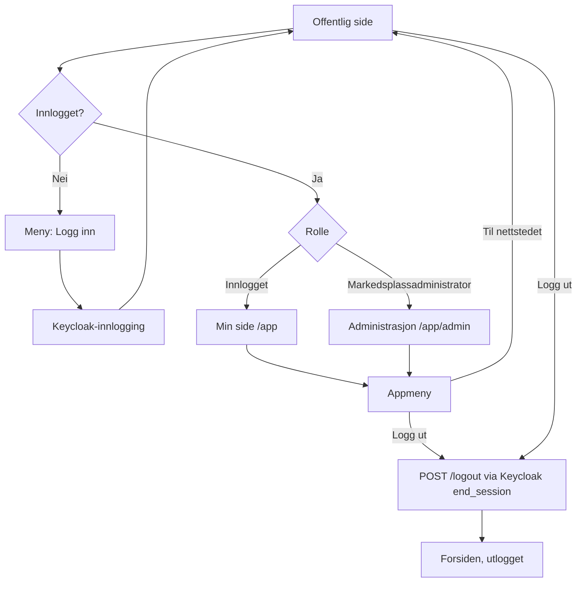

# Userflow 10: Navigasjon, innlogging og utlogging

Status: **Besluttet, ikke implementert.** Avklart 2026-09-24 i to
grilling-økter; revidert etter beslutningsnotat 0007. Beskriver hvor hver lenke tar hver bruker, og hvor grensen går
mellom den offentlige SEO-flaten og Vaadin-appen.

## Grensen mellom offentlig flate og app

| Flate | Stier | Teknologi | Innhold |
| --- | --- | --- | --- |
| Offentlig (SEO) | `/`, `/utstyr`, `/utstyr/{slug}`, `/selg`, sitemap, robots, feilsider | Spring MVC + Thymeleaf | Alt som skal kunne finnes, leses og deles uten innlogging |
| App | `/app/**` | Vaadin Flow | Alt som krever innlogging: Min side, utkast, bud, handler, administrasjon |

Regel: en side som krever innlogging og aldri skal indekseres hører hjemme i
appen. `/selg` er offentlig fordi den forklarer hvordan man selger.

## Meny

Kjøper og selger er ikke kontotyper (beslutningsnotat 0007), så menyen
skiller bare på innlogget og markedsplassadministrator. Søkemotorer ser
alltid utlogget variant.

| Person | Offentlig meny (mål) |
| --- | --- |
| Utlogget | Utforsk utstyr · Selg utstyr · Logg inn |
| Innlogget | Utforsk utstyr · Selg utstyr · Min side · Logg ut |
| Markedsplassadministrator | Utforsk utstyr · Selg utstyr · Min side · Administrasjon · Logg ut |

- «Selg utstyr» betyr alltid «start en annonse»: utlogget til `/selg`
  (forklaring og innlogging), innlogget rett til et nytt utkast i appen.
- «Min side» (`/app`) samler personens virksomheter og tilknytninger
  (venter/verifisert), utkast og annonser til godkjenning, bud og handler.
- «Administrasjon» → `/app/admin`.

**Mellomtrinn:** Inntil appen er åpnet for alle innloggede personer (migrering
etter 0007) vises ikke «Min side», og «Selg utstyr» går til `/selg` for alle.
Menyen lenker aldri til en side personen får 403 på.

Appen får sin egen meny med appfunksjoner, «Til nettstedet» og «Logg ut».

## Innlogging og utlogging

- **Logg inn** (offentlig meny): gå via Keycloak og tilbake til siden der
  brukeren trykket «Logg inn». Menyen viser deretter rollelenken.
- **Beskyttet side** (f.eks. `/app/admin`) uten innlogging: via Keycloak og
  tilbake til den forespurte siden.
- **Logg ut** (begge menyer): `POST /logout` med CSRF-token, via Keycloaks
  `end_session_endpoint` (også Keycloak-økten avsluttes), og alltid til
  forsiden.
- **Manglende rolle**: 403-siden, med lenke til forsiden.

## Verifisering over tid

Verifisering av tilknytninger, annonser og handler skjer asynkront (se 0007);
personen kan ikke antas å ha siden åpen.

- **Varsel:** personen får e-post når en tilknytning er verifisert, en annonse
  er godkjent eller en handel er verifisert. *Besluttet, bygges senere;*
  krever beslutningsnotat om e-posttjeneste (lokalt f.eks. Mailpit).
- **Personen har appen åpen:** Vaadin viser et varsel som krever aktiv
  handling og leder til riktig sted på Min side.

## Gjenstår å avklare

- Innhold og avsender for e-postvarselet.
- Om avslag også skal gi live-varsel på åpen side.
- «Om oss»/«Kontakt» fra designhåndboken og userflow 1 er ikke med ennå.
