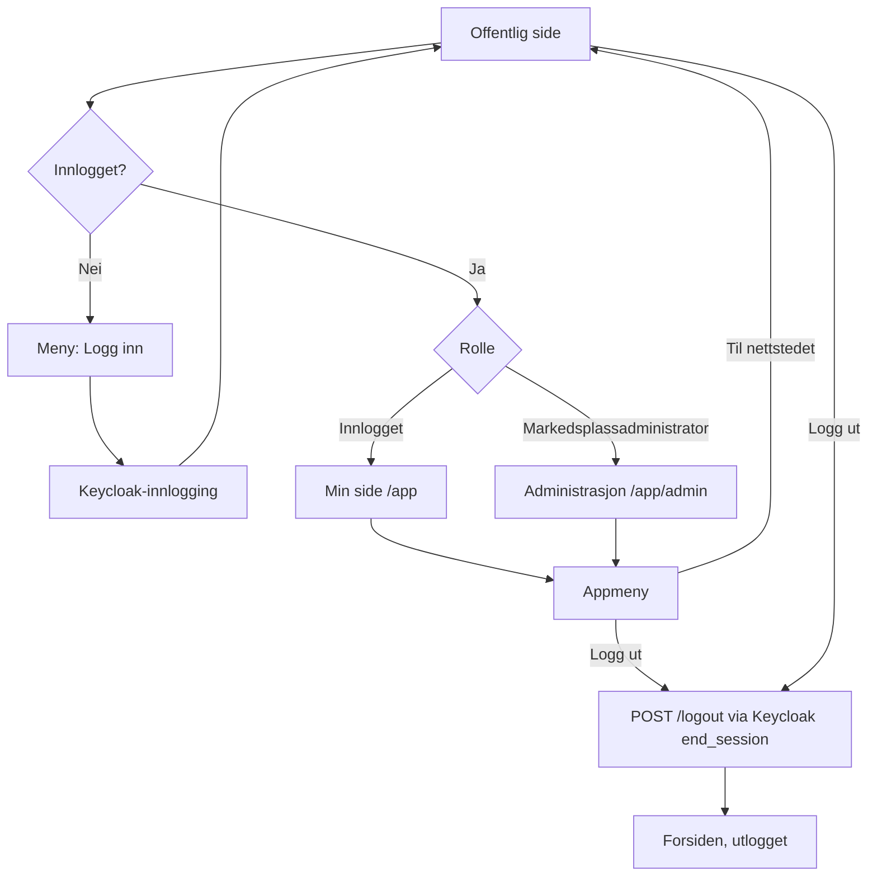

# Userflow 10: Navigasjon, innlogging og utlogging

Status: **Besluttet, ikke implementert.** Avklart 2026-09-24 i to
grilling-økter; revidert etter beslutningsnotat 0007 og manuell test. Beskriver hvor hver lenke tar hver bruker, og hvor grensen går
mellom den offentlige SEO-flaten og Vaadin-appen.

## Grensen mellom offentlig flate og app

| Flate | Stier | Teknologi | Innhold |
| --- | --- | --- | --- |
| Offentlig (SEO) | `/`, `/utstyr`, `/utstyr/{slug}`, `/selg`, sitemap, robots, feilsider | Spring MVC + Thymeleaf | Alt som skal kunne finnes, leses og deles uten innlogging |
| App | `/app/**` | Vaadin Flow | Interaktivt arbeid: Min side, utkast, bud, handler, administrasjon |

Regel: innhold som skal kunne finnes og deles hører hjemme på den offentlige
flaten; interaktivt arbeid hører hjemme i appen og indekseres aldri
(beslutningsnotat 0002: «innloggede og interaktive appflater»). Appen kan ha
ruter uten innlogging; innlogging kreves først når den trengs. `/selg` er
offentlig fordi den forklarer hvordan man selger.

## Meny

Kjøper og selger er ikke kontotyper (beslutningsnotat 0007), så menyen
skiller bare på innlogget og markedsplassadministrator. Søkemotorer ser
alltid utlogget variant.

| Person | Offentlig meny (mål) |
| --- | --- |
| Utlogget | Utforsk utstyr · Selg utstyr · Logg inn |
| Innlogget | Utforsk utstyr · Selg utstyr · Min side · Logg ut |
| Markedsplassadministrator | Utforsk utstyr · Selg utstyr · Min side · Administrasjon · Logg ut |

- «Selg utstyr» betyr alltid «start en annonse». Et utkast tilhører en
  innlogget person og en virksomhet, slik at det kan fortsettes fra en annen
  enhet (telefon eller datamaskin). Første steg er derfor å bekrefte
  e-postadressen (rask registrering eller innlogging), deretter et nytt
  utkast i appen. Det lagres ingenting og lastes ikke opp filer før
  innlogging.
- «Min side» (`/app`) samler personens virksomheter og tilknytninger
  (venter/verifisert), utkast og annonser til godkjenning, bud og handler.
- «Administrasjon» → `/app/admin`.

**Mellomtrinn:** Inntil appen er åpnet for alle innloggede personer (migrering
etter 0007) vises ikke «Min side», og «Selg utstyr» går til `/selg` for alle.
Menyen lenker aldri til en side personen får 403 på.

Appen får sin egen meny med appfunksjoner, «Til nettstedet» og «Logg ut».

## Innlogging og utlogging

- **Etter innlogging, etter oppgave og rolle:**
  - Markedsplassadministrator går alltid til Administrasjon. Grensen rundt
    administrasjonen holdes stram; en administrator skal ikke surfe som
    administrator.
  - En person som logger inn midt i en oppgave (en annonse, et bud)
    fortsetter der den var.
  - Vanlig «Logg inn» fra menyen går til Min side.
- **Beskyttet side** (f.eks. `/app/admin`) uten innlogging: via Keycloak og
  tilbake til den forespurte siden.
- **Logg ut** (begge menyer): `POST /logout` med CSRF-token, via Keycloaks
  `end_session_endpoint` (også Keycloak-økten avsluttes), og alltid til
  forsiden.
- **Manglende rolle**: 403-siden, med lenke til forsiden.

## Verifisering over tid

Verifisering av tilknytninger, annonser og handler skjer asynkront (se 0007);
personen kan ikke antas å ha siden åpen.

- **Varsel:** personen får e-post når en tilknytning er verifisert, en annonse
  er godkjent eller en handel er verifisert. *Besluttet, bygges senere;*
  krever beslutningsnotat om e-posttjeneste (lokalt f.eks. Mailpit).
- **Personen har appen åpen:** Vaadin viser et varsel som krever aktiv
  handling og leder til riktig sted på Min side.

## Gjenstår å avklare

- Om Keycloak kan gi innlogging uten passord via e-post (lenke eller kode)
  uten utvidelser. Avgjør hvor lav terskelen for «Selg utstyr» kan bli.
- Senere: mobilapp som lagrer utkast lokalt og laster opp etter innlogging.

- Innhold og avsender for e-postvarselet.
- Om avslag også skal gi live-varsel på åpen side.
- «Om oss»/«Kontakt» fra designhåndboken og userflow 1 er ikke med ennå.
