# PDF-diagrammer: offentlig SEO-app

Kilde: `Design av digital løsning Fagskolen.pdf`, spesielt sitemapet for offentlig tilgjengelig app:

```text
Hjem → Browse/Utforsk utstyr → Kategori → Listedetaljer
Salg
Om/Kontakt
Logg inn
```

Diagrammene under er også lagret som separate Mermaid-kilder i `docs/userflows/diagrams/` og eksporteres til PDF i `docs/userflows/pdf/`.

## Implementasjonsstatus

Ingen av de fem opprinnelige diagrammene er fullført ende-til-ende. De
beskriver et bredere målbilde enn den implementerte prototypen.

| Diagram | Status | Implementert | Ikke implementert |
| --- | --- | --- | --- |
| 1. Offentlig sitemap og SEO-innganger | Delvis | `/`, `/utstyr`, `/utstyr/{slug}`, `/selg`, sitemap og robots | Kategorisider, `/om`, offentlig innlogging og forespørsel |
| 2. Kjøper finner utstyr fra forsiden | Delvis | Forside, publiserte annonser, katalog, søk og detaljside | Kategorinavigasjon, kjøperkonto, lagring og forespørsel |
| 3. Browse/filter til listedetalj | Delvis | Katalog, fritekst, lokasjon, tilstand, nulltreff og detaljside | Prisfilter og kategori-URL-er |
| 4. Listedetalj til forespørsel eller lagring | Delvis | Publisert detaljside med selger- og dokumentasjonsdata | Forespørsel, lagring, kjøperinnlogging og retur-URL |
| 5. Selger starter fra offentlig side | Delvis | `/selg`, Keycloak-innlogging, `SELLER`-krav på `/app`, privat opprettelse av utkast og publisering | Bilder, dokumenter, redigering og arkivering |
| 7. Administrator godkjenner selgersøknad | Delvis | Server-rendered `/selgersoknad`, vedvarende `PENDING`-søknad, `/app/admin`, auditlogg, aktivering av selgerkonto, administratorutlogging og testet Keycloak Admin API-adapter | E-postverifisert selvregistrering, rate limiting og per-miljø service-konto/hemmelighet |
| 8. Operatør installerer og bootstrapper miljø | Delvis | Lokal Compose, realm-import og beskyttet `/app/admin` | Produksjonsrunbook, hemmelighetsforvaltning og tilgangsregister |
| 9. Lokal demo og rollebytte | Ferdig for lokal demo | Demo-identiteter, Keycloak-profil, søknad, godkjenning, reinnlogging og 403-/innloggingsfeil | Selvregistrering og produksjonsidentiteter |
| 10. Navigasjon, innlogging og utlogging | Delvis | Offentlig meny med Min side, innlogging lander på Min side (administrator på Administrasjon), logg ut via Keycloak til forsiden | Egen appmeny (#17), retur etter innlogging midt i en oppgave, varsler. Se `navigasjon-og-innlogging.md` |
| 11. Tilknytning til virksomhet | Delvis | Registrere virksomhet på Min side, gjenbruk av eksisterende virksomhet, tilknytning venter (#16) | Verifisering, avvisning og tilbaketrekking (#18) |
| 12. Annonse fra utkast til publisert | Utkast (0007) | – | Alt |
| 13. Bud | Utkast (0007) | – | Alt |
| 14. Handel og handelsverifisering | Utkast (0007) | – | Alt |
| 15. Lagret annonse | Utkast | – | Alt |

Diagram 6 dekker den implementerte selgerflyten som ikke fantes da de
opprinnelige diagrammene ble laget.

## 1. Offentlig sitemap og SEO-innganger

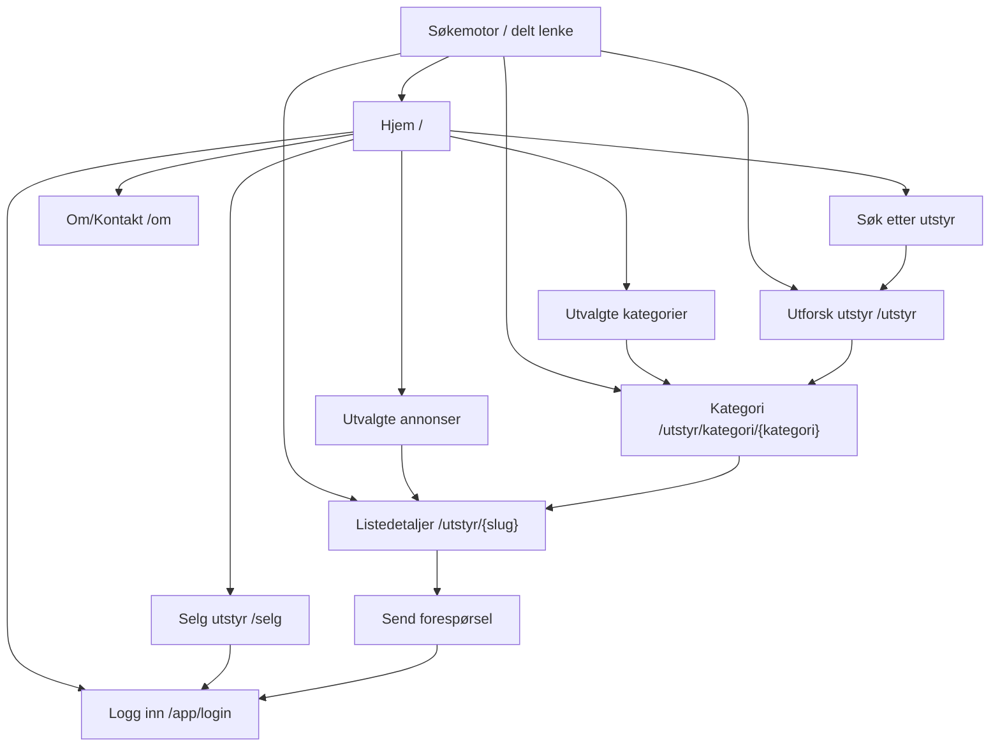

## 2. Kjøper finner utstyr fra forsiden

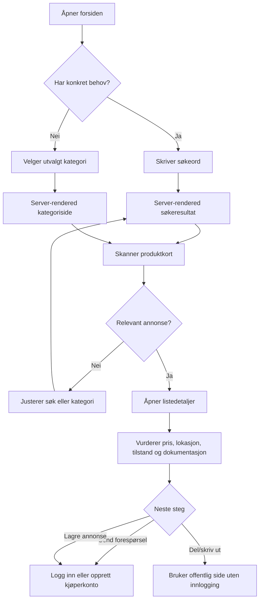

## 3. Browse/filter til listedetalj

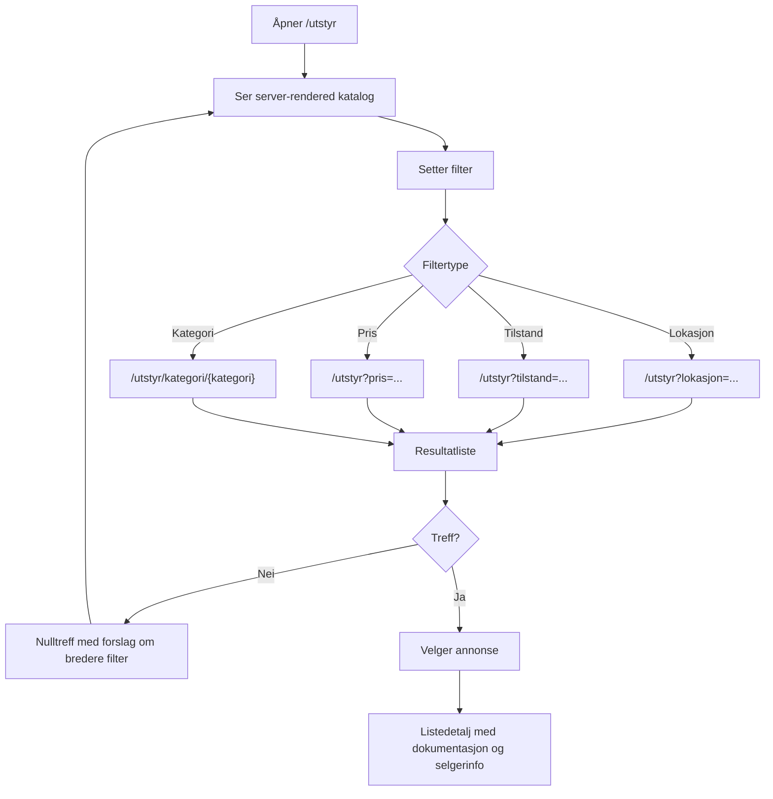

## 4. Listedetalj til forespørsel eller lagring

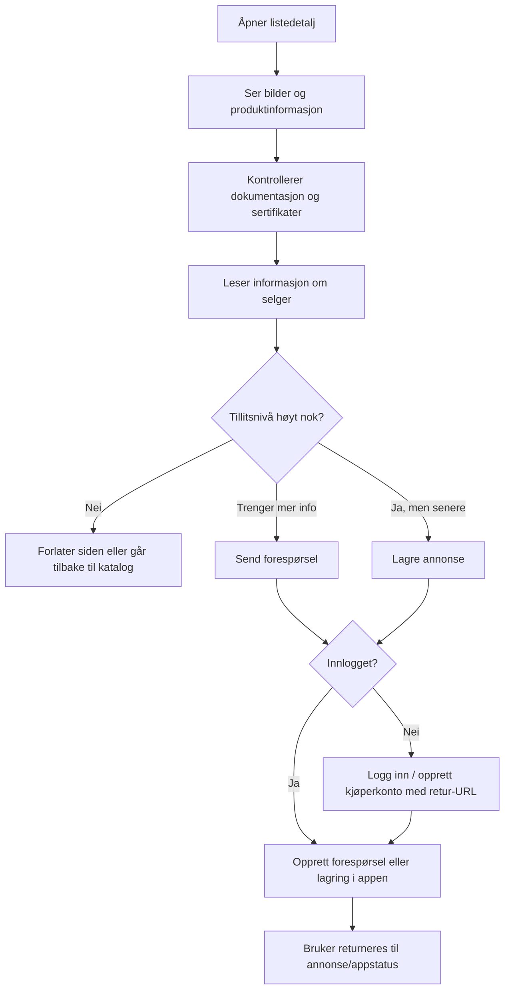

## 5. Selger starter fra offentlig side

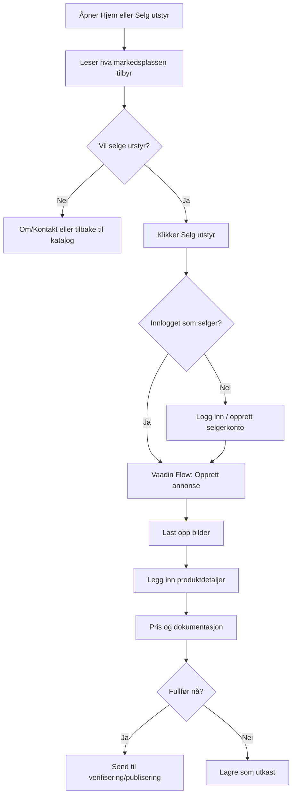

## 6. Innlogget selger oppretter privat utkast

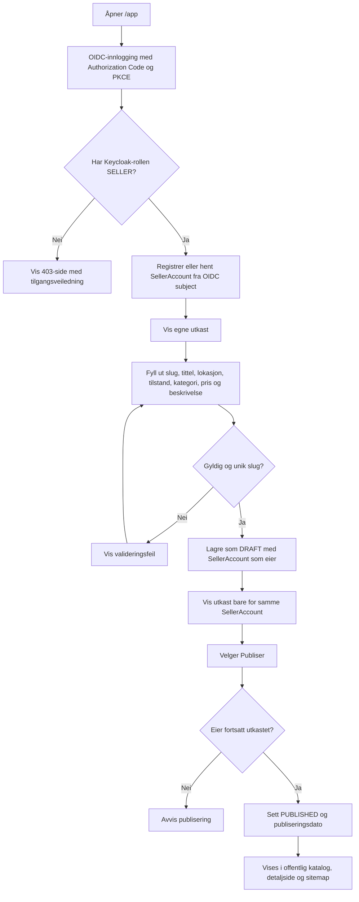

## 7. Administrator godkjenner selgersøknad

Viser dagens implementasjon. **Erstattet av beslutningsnotat 0007:** selgersøknad og varig `SELLER`-rolle fases ut til fordel for verifisert tilknytning, annonsegodkjenning og handelsverifisering. Ny flyt tegnes når migreringen planlegges.

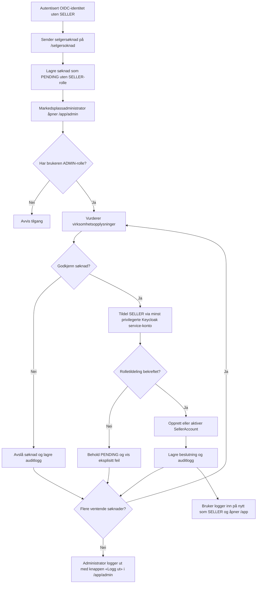

## 8. Operatør installerer og bootstrapper miljø

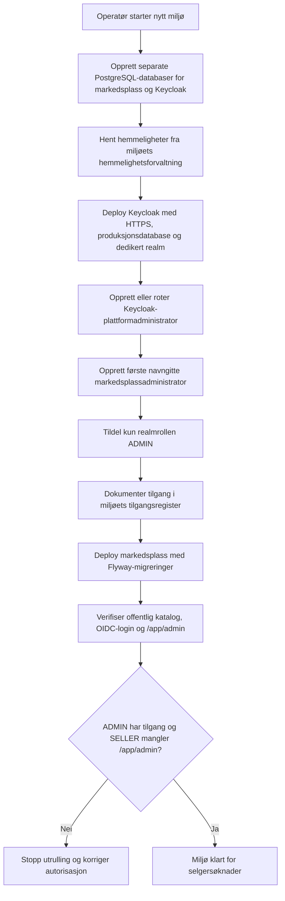

## 9. Lokal demo og rollebytte

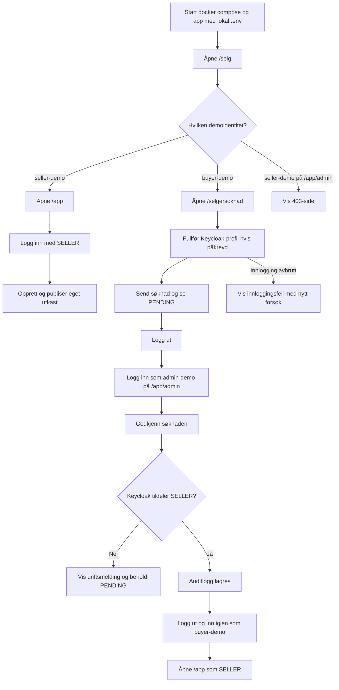

## 10. Navigasjon, innlogging og utlogging

Detaljer, menyer per person og grensen mellom offentlig flate og app: `navigasjon-og-innlogging.md`.

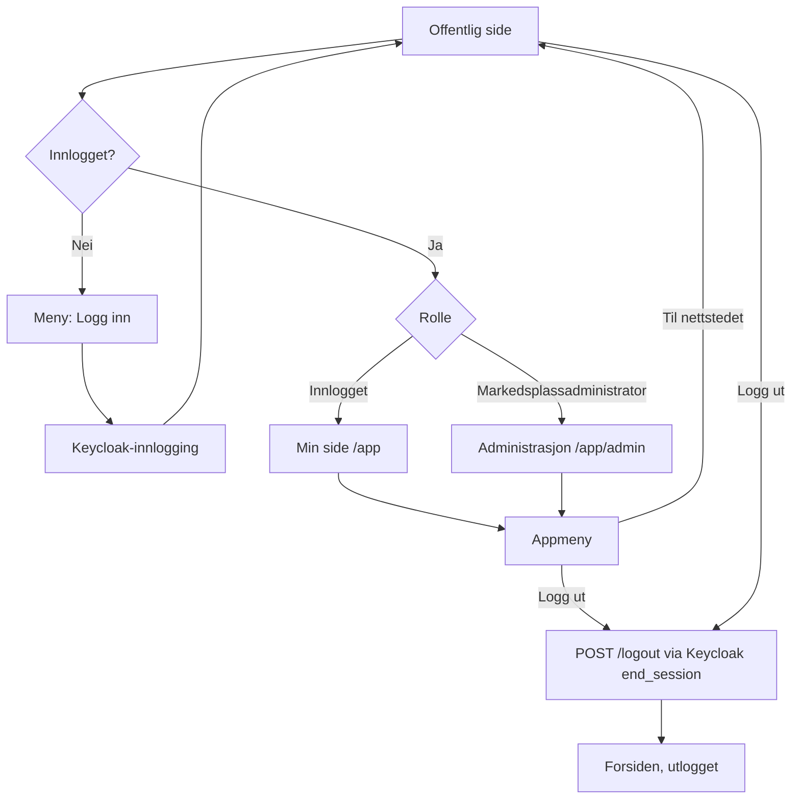

## 11. Tilknytning til virksomhet

Beslutningsnotat 0007. Avvist og trukket tilbake er ulike utfall (S3).

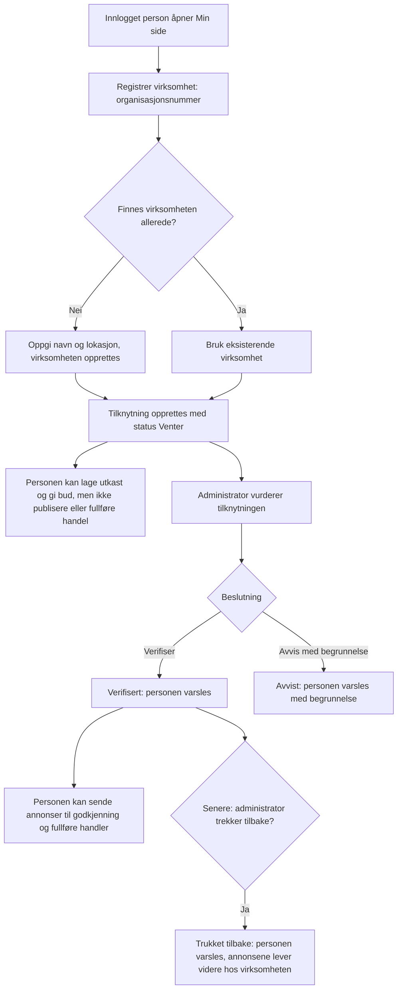

## 12. Annonse fra utkast til publisert

Beslutningsnotat 0007. Ingen egen status for avslått; en uakseptabel annonse arkiveres (S4).

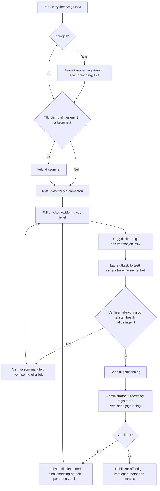

## 13. Bud

Et bud kan gis før tilknytningen er verifisert (0007). Et bud har ingen tidsfrist; det står til selgeren aksepterer eller avslår, eller kjøperen trekker det (S6).

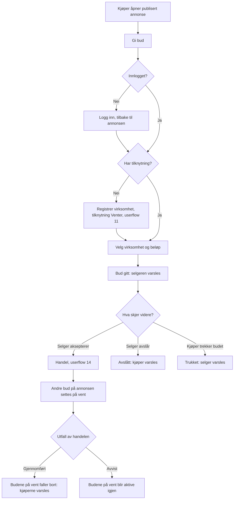

## 14. Handel og handelsverifisering

Beslutningsnotat 0007. Utfall besluttet i grilling (S5/S7).

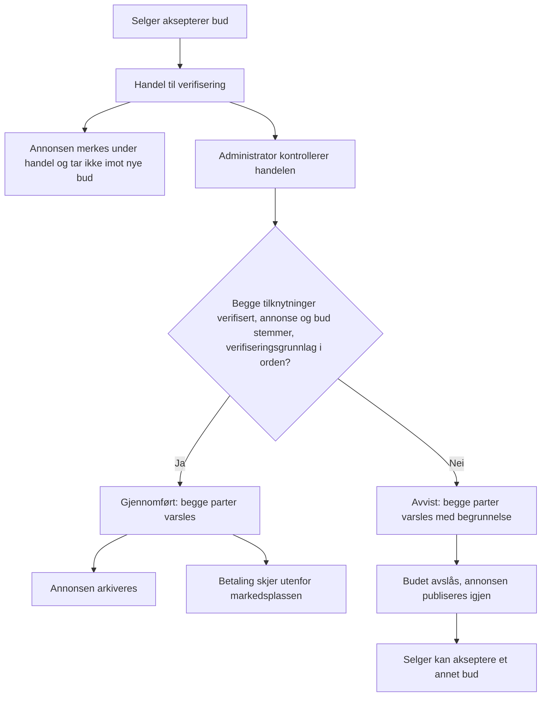

## 15. Lagret annonse

En person lagrer en annonse for å finne den igjen, sammenligne og følge endringer (grilling S9). Lagrede annonser er personlige og krever innlogging. Detaljerer lagringsdelen av userflow 4.

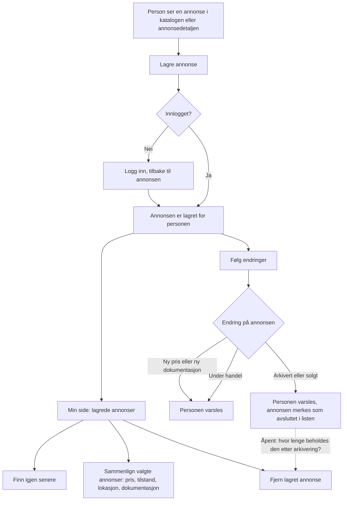
