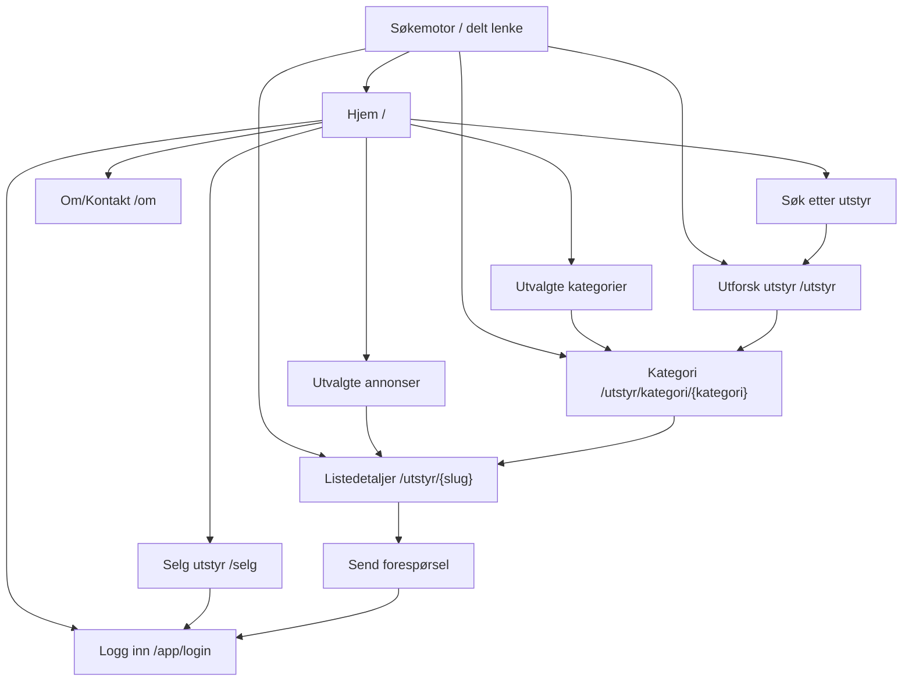
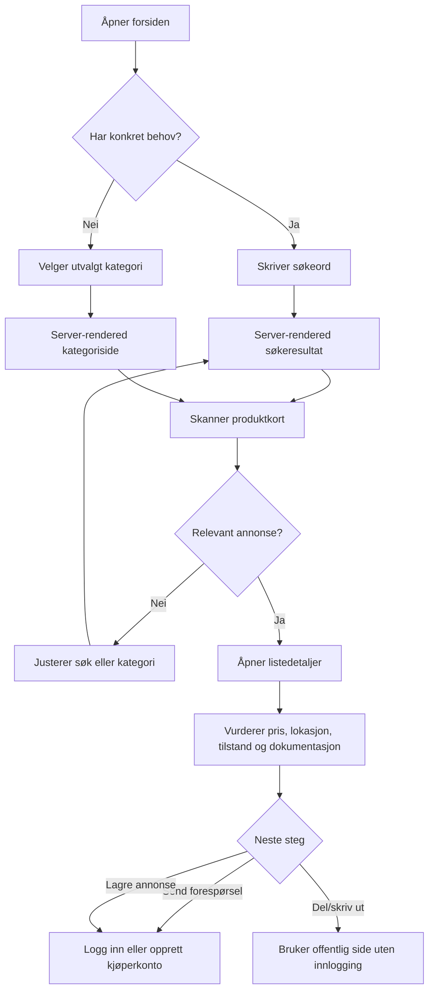
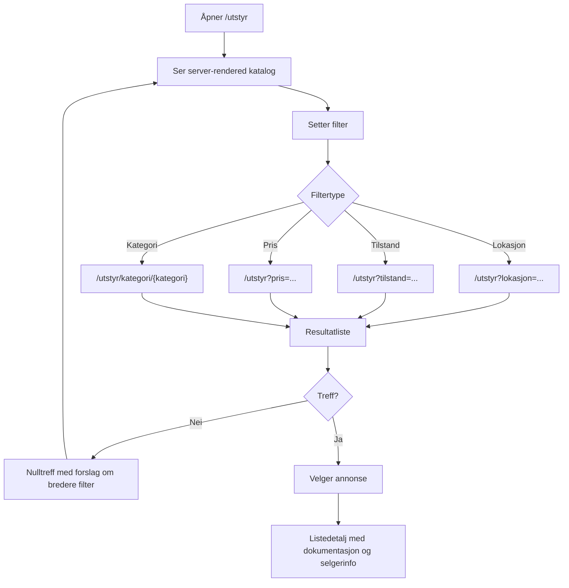
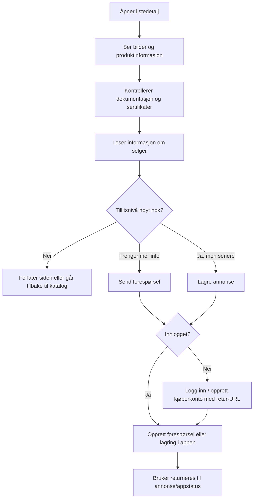
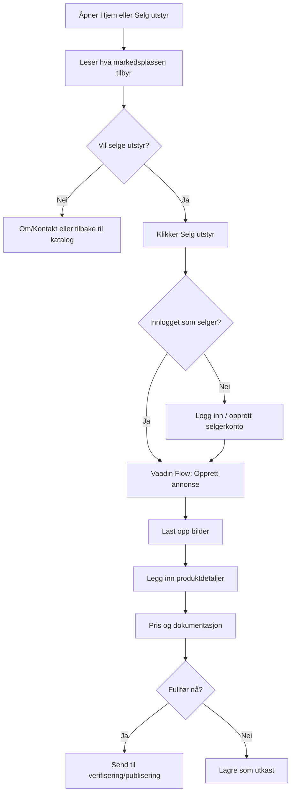

# PDF-diagrammer: offentlig SEO-app

Kilde: `Design av digital løsning Fagskolen.pdf`, spesielt sitemapet for offentlig tilgjengelig app:

```text
Hjem → Browse/Utforsk utstyr → Kategori → Listedetaljer
Salg
Om/Kontakt
Logg inn
```

Diagrammene under er også lagret som separate Mermaid-kilder i `docs/userflows/diagrams/` og eksporteres til PDF i `docs/userflows/pdf/`.

## 1. Offentlig sitemap og SEO-innganger



## 2. Kjøper finner utstyr fra forsiden



## 3. Browse/filter til listedetalj



## 4. Listedetalj til forespørsel eller lagring



## 5. Selger starter fra offentlig side


