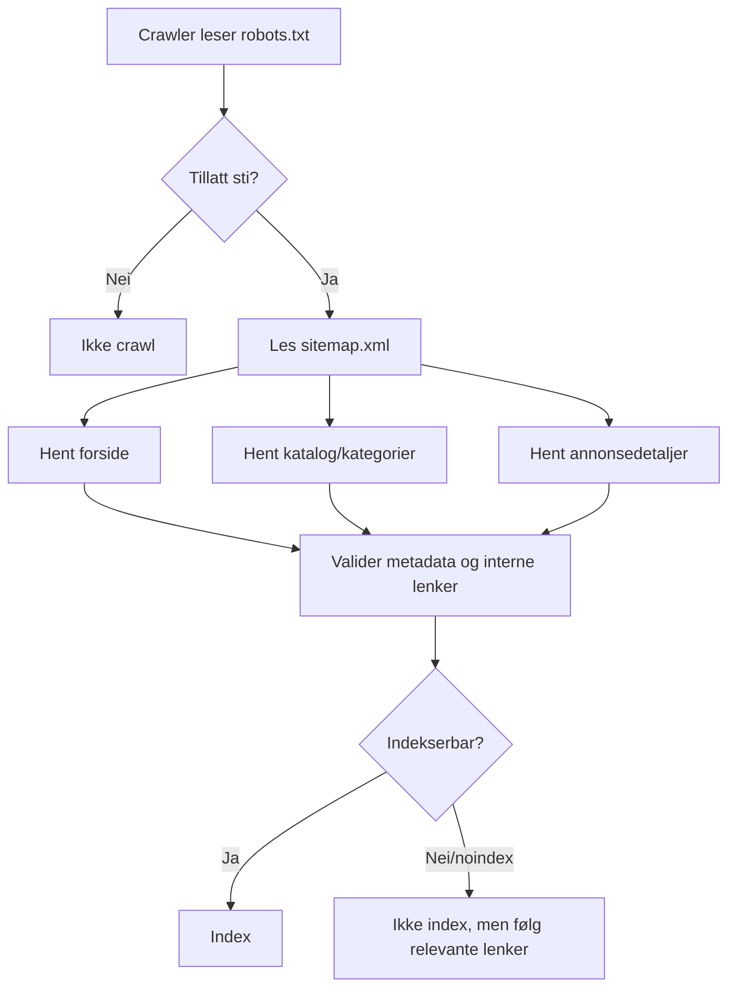

# Userflows: offentlig SEO-app

Disse flytene beskriver den offentlige, indeksérbare delen av markedsplassen. De skal kunne forstås uten innlogging og uten at en crawler må kjøre Vaadin-klienten. Vaadin Flow brukes fortsatt for appflater bak `/app`.

## 1. Organisk søk til annonsedetalj

```mermaid
flowchart TD
    A[Søkemotor viser annonsedetalj] --> B[Bruker åpner /utstyr/{slug}]
    B --> C{Annonse finnes?}
    C -- Nei --> D[Server-rendered 404 med lenke til katalog]
    C -- Ja --> E[Server-rendered annonsedetalj]
    E --> F[Les tittel, pris, lokasjon og tilstand]
    F --> G[Kontroller dokumentasjon og selgerinformasjon]
    G --> H{Vil kontakte selger?}
    H -- Nei --> I[Tilbake til katalog eller del/skriv ut]
    H -- Ja --> J{Innlogging påkrevd?}
    J -- Ikke ennå --> K[Åpen interesseskjema / forespørsel]
    J -- Ja --> L[Sendes til /app/login med retur-URL]
    L --> M[Etter innlogging: forespørsel knyttes til annonse]
```

**Krav som følger av flyten**

- `title`, `meta description`, kanonisk URL og semantisk `h1` må settes per annonse.
- Viktige annonsefelt må ligge i HTML-responsen: tittel, pris, lokasjon, tilstand, sammendrag, selger og dokumentliste.
- 404-siden må være nyttig for både bruker og crawler.
- Kontaktsteg kan vente, men CTA og retur-URL må planlegges nå.

## 2. Katalog- og filterflyt

```mermaid
flowchart TD
    A[Bruker åpner /utstyr] --> B[Server-rendered katalog med standard sortering]
    B --> C[Skanner produktkort]
    C --> D{Bruker avgrenser?}
    D -- Søkeord --> E[/utstyr?q=...]
    D -- Kategori --> F[/utstyr/kategori/{kategori}]
    D -- Lokasjon/tilstand --> G[/utstyr?lokasjon=...&tilstand=...]
    D -- Nei --> H[Åpner relevant annonse]
    E --> I[Server-rendered resultatside]
    F --> I
    G --> I
    I --> J{Treff?}
    J -- Ja --> H
    J -- Nei --> K[Nulltreffside med forslag til bredere søk]
```

**Krav som følger av flyten**

- Filter-URL-er må være delbare og crawlbare der de har SEO-verdi.
- Ikke alle kombinasjoner bør indekseres. Kategori- og eventuelt lokasjonssider kan være indeksérbare; tynne/nulltreff-filter bør få `noindex`.
- Produktkort må ha lenker som fungerer uten JavaScript.
- Sortering/filter må kunne forbedres interaktivt senere uten å miste server-rendered grunnrespons.

## 3. Crawlerflyt og indekskontroll



**Krav som følger av flyten**

- Legg til `robots.txt` og `sitemap.xml` når route-/dataformatet stabiliseres.
- Annonsedetaljer bør bare ligge i sitemap når de er publiserte og komplette nok.
- Utkast, innloggede sider og interne appflater under `/app` skal ikke indekseres.
- Metadata må kunne testes med serverrespons, ikke visuell rendering alene.

## 4. Offentlig appflate mot innlogget Vaadin-app

```mermaid
flowchart LR
    A[Offentlig forside /] --> B[Offentlig katalog /utstyr]
    B --> C[Offentlig annonsedetalj /utstyr/{slug}]
    C --> D{Handling}
    D --> E[Del eller skriv ut]
    D --> F[Send forespørsel]
    D --> G[Selg lignende utstyr]
    F --> H{Krever konto?}
    G --> I[/app]
    H -- Nei --> J[Åpent kontaktskjema]
    H -- Ja --> I[Vaadin Flow appflate]
```

**Grense mellom offentlig SEO og Vaadin Flow**

- Offentlige sider: `/`, `/utstyr`, `/utstyr/{slug}`, senere kategori- og selgerprofilsider.
- Vaadin Flow: `/app` og underliggende selger-/adminflyter.
- Deling, utskrift og grunnleggende lesing hører hjemme offentlig.
- Oppretting, administrasjon, dialog med selger og konto hører hjemme i appflaten.
